# Rainbow Sines
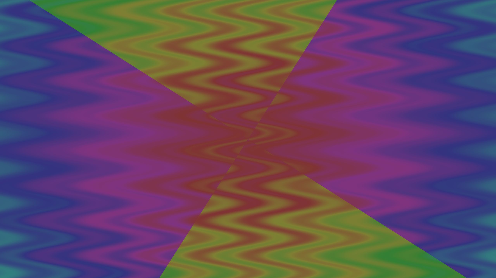

# Nebula
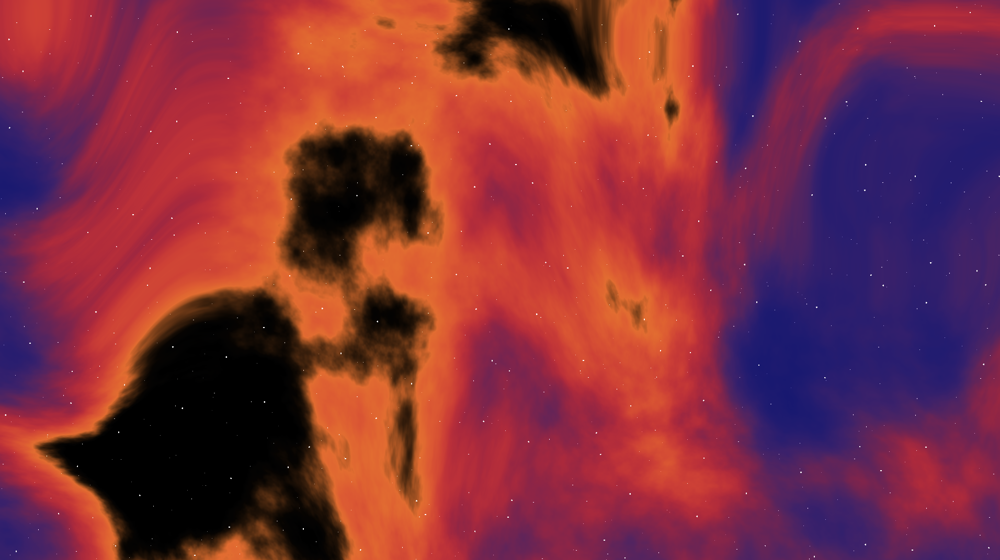

# SDF 1

# SDF 2 - With materials
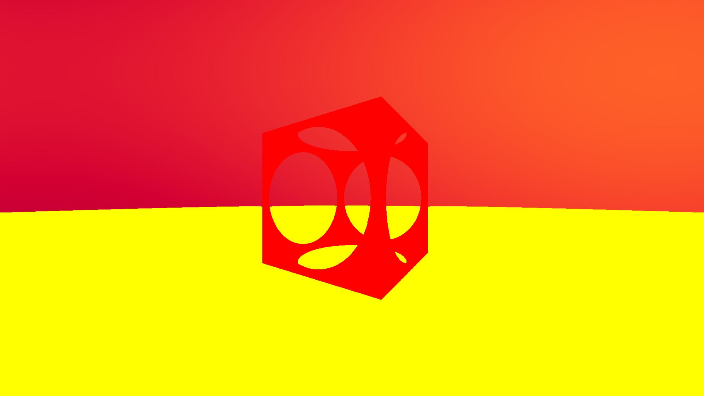

# SDF 3 - Lighting
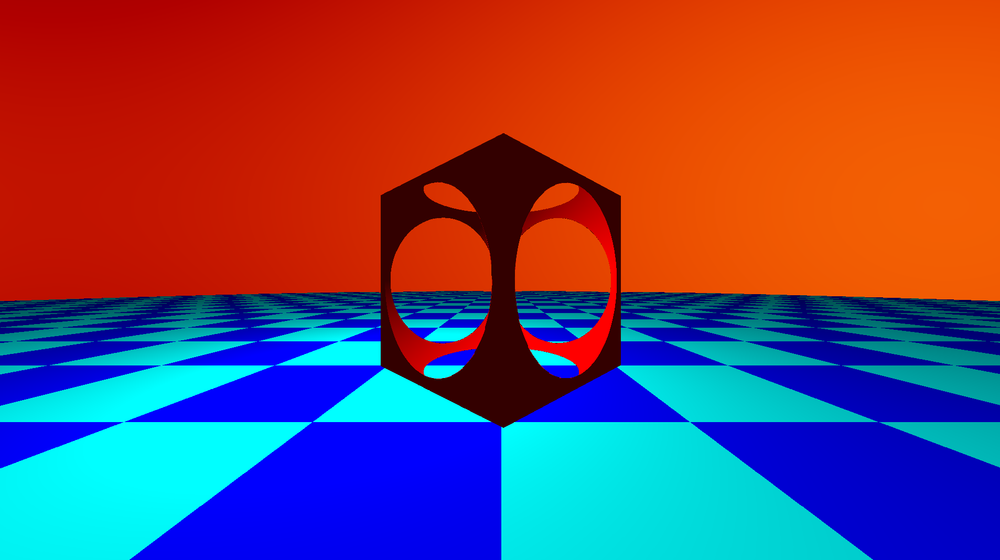

# SDF 4 - Hard shadows
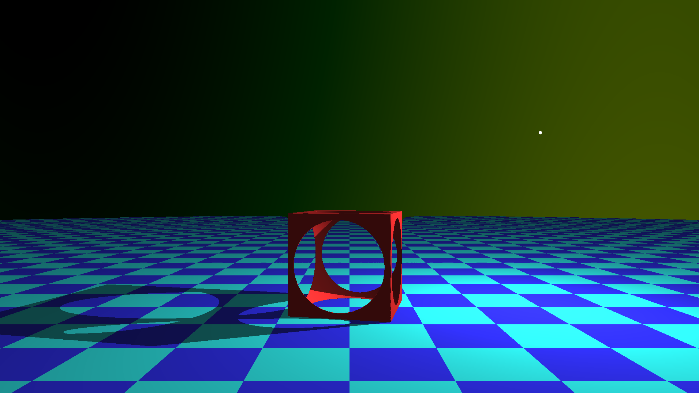

# SDF 5 - Soft shadows
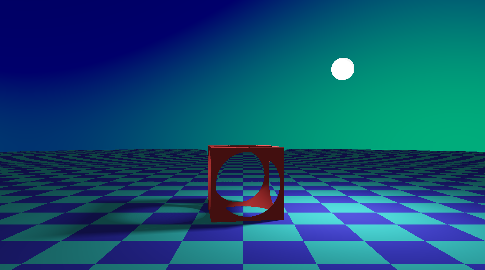

# SDF 6 - Ambient Occlusion (hemisphere and normal sampling)
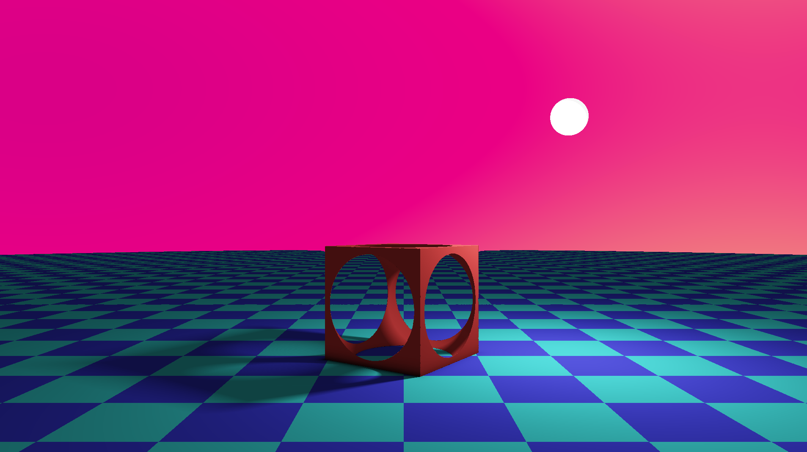

# SDF 7 - Fog
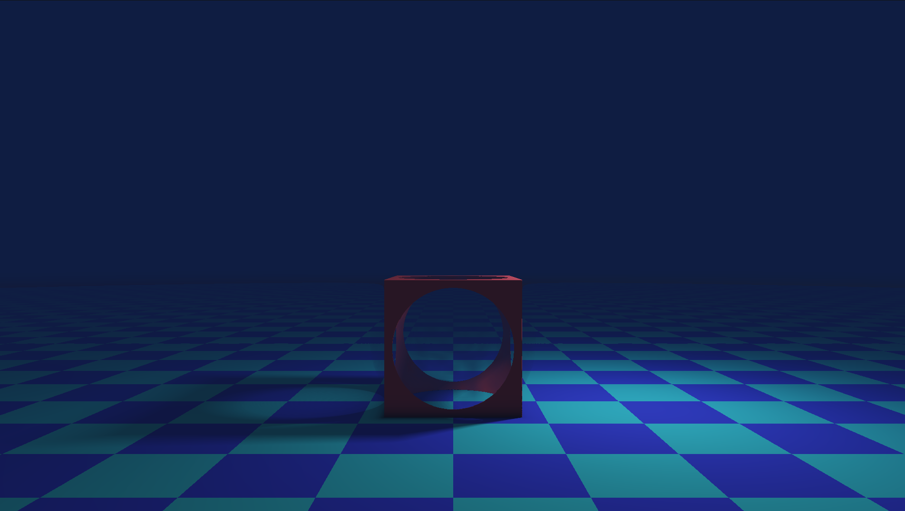

# SDF 8 - Scattering with shadows

Extremely slow with any decent quality

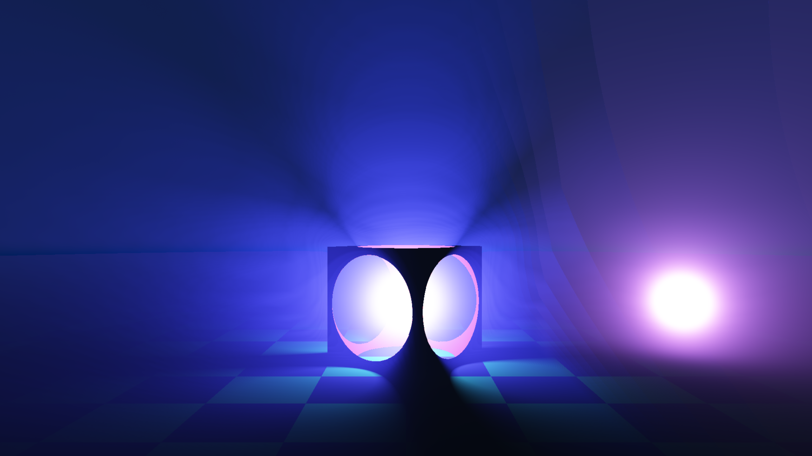

# SDF 9 - Emissive-based lighting

Doesn't work too well with multiple sources, only the nearest will be used, but as a proof of concept it was interesting.
Shadows also don't look proper.

# SDF 10 - Displacement

Displacement works, controlled by the FFT... Not very convinced with that, to be honest

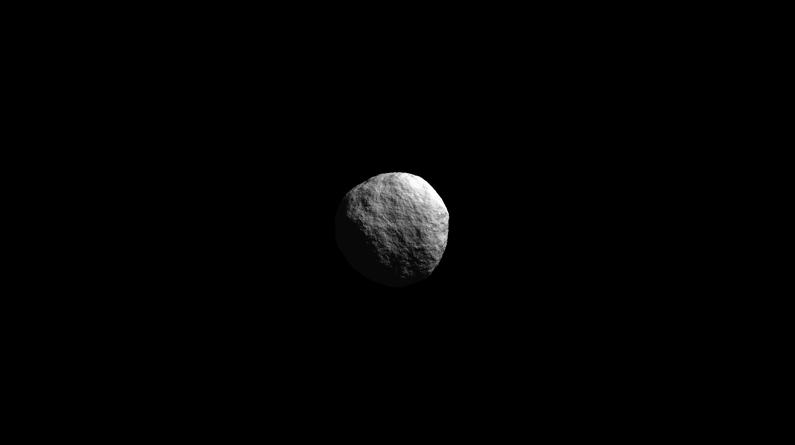

# Terrain

First experiments with terrain, the results are terrible, need to work on that in the future.
This one also has an experiment with shell-based fur.

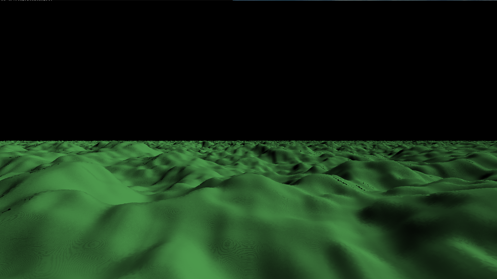

# Future experiments

* Lighting
  * Heat haze
  * Reflections
  * Refraction
  * Fur
* Feedback loops
  * Motion/Image blur
  * Particle systems
* Modelling
  * Terrain
  * Camera look at
  * Repetition elements
  * Twist
  * Spiral DNA
  * Virus
  * Cat
  * Fractals
    * Tentacle cubes
  * L-Systems
  * Wicker weave (https://demarleather.com/wp-content/uploads/2020/03/Demar-Final-524b.jpg)